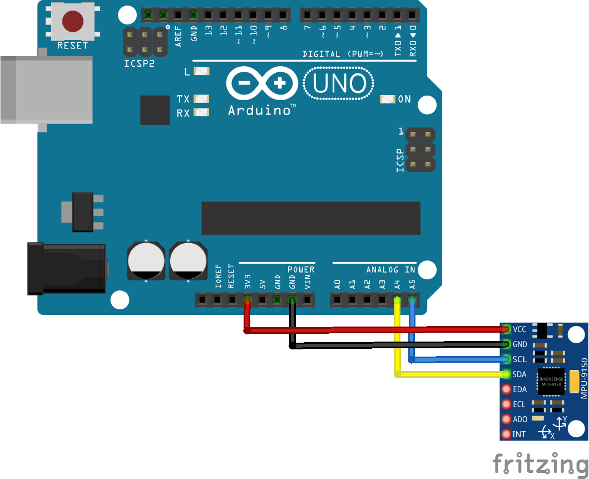
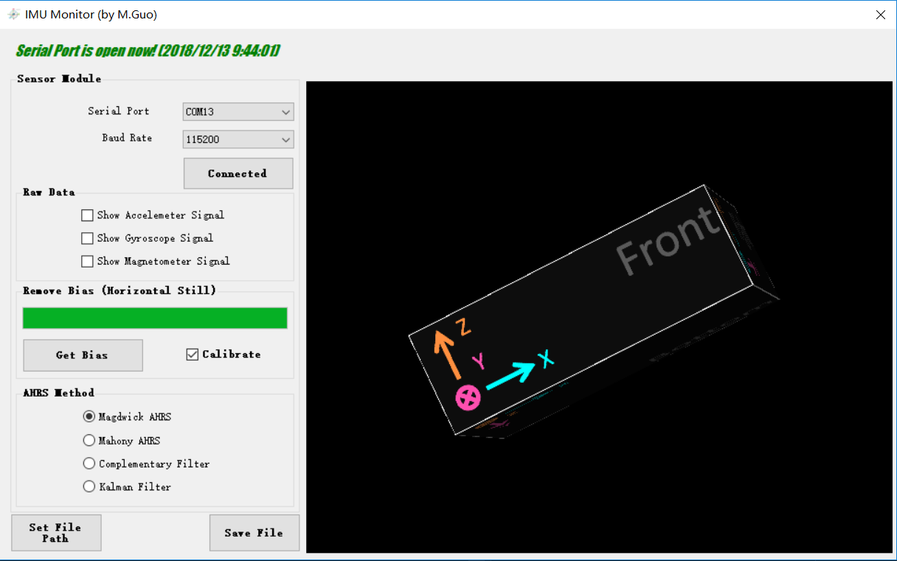

# MPU9250-AHRS-Arduino

利用MPU9250和Aruduino UNO搭建一个简易的ARHS硬件平台，如下图所示，

  
  
   
  <em>Fig. 1: 简易AHRS硬件系统，可利用蓝牙与上位机通信</em>

## 硬件功能

1. Arduino通过I2C读取MPU9250模块9轴数据；
2. 对数据添加校验位并进行编码，之后通过串口发送；
3. 采用一块7.4V锂电池通过DC接口(7~12V)进行供电；

## 连接示意图

  
   
  <em>Fig. 2:Arduino与MPU9250连接示意图</em>

## 上位机功能

1. 接收硬件数据，解码后得到正确的传感器数据；
2. 进行AHRS解算，得到姿态角；
3. 姿态角的实时三维显示；

  
   
  <em>Fig. 3:上位机</em>

## 参考资料

[MPU-9250 Accelerometer, Gyroscope and Magnetometer Code](http://robojax.com/learn/arduino/?vid=robojax-MPU9250)